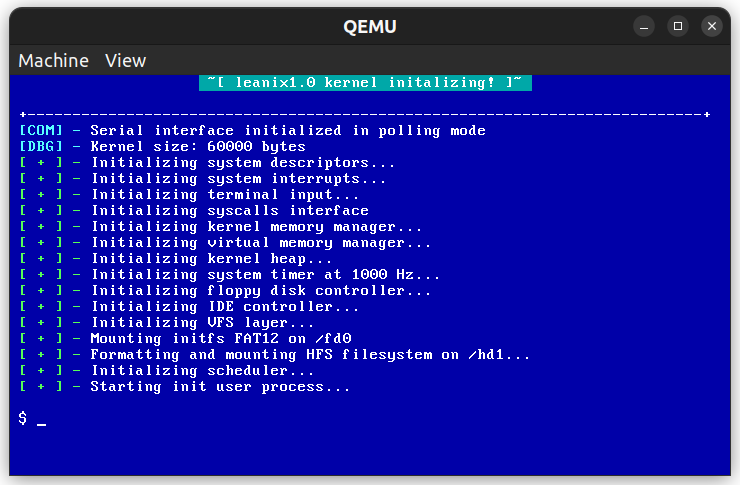

# CS370 Kernel

This repository contains the source code for LeanixOS, a lean and small teaching kernel used for CS370 Operating Systems course at LUMS. Here's a brief overview of the directories:

| Directory | Description |
|-----------|-------------|
| `include` | Contains header files for kernel interfaces and structures. |
| `boot`    | Contains the 16 bit real mode bootloader for the kernel. |
| `driver`  | Contains device drivers for various hardware components. |
| `init`    | Contains the kernel entry point, and the system initialization routines. |
| `user`    | Contains the user land code examples |
| `tests`  	| Contains the test suites for various kernel subsystems. |
| `proc`  	| Contains the process management code subsystem. |
| `fs`	  	| Contains the filesystem code. |
| `mm`	  	| Contains the memory management code subsystem. |
| `libc` 	| Contains a simple C standard library implementation for the kernel. |

**Note that since this project is used for assignments, the source code has been redacted. However, instead object files for the student components are provided to compile and run the source. All interfaces in include files are available publically.**

## Build pre-reqs

Currently the build has been on Linux, Windows WSL and MacOS. But, in any case, the following are the must required:

- `gcc`, `as`, `ld`, `gdb` (note that that toolchain **MUST** be for x86)
	- if your toolchain is for x86-64, make sure to install the `gcc-multilib` package, so that you can compile 32 bit code
- `make`
- `qemu` (for running the kernel), especially the `qemu-system-i386` package
- `bochs` is optional, but good to have as an addition emulator
- `mtools` and `dosfstools` (for creating FAT12 filesystems)
- `dd` (for creating disk images)
- `python3` and `pytest` (for running the test suites)

## Build instructions

In order to build the whole thing, including the bootloader, the kernel and the disk image, use command `make`. Similarly, to clean the build, use `make clean`.

The build will generate a file called `disk.img` in the root directory, which is a bootable hard disk image that can be used with `qemu` or `bochs`.

To launch `qemu` or `bochs`, you can use the following commands:
- `make qemu` : builds the entire thing, and load the image in QEMU.
- `make bochs` : builds the entire thing, and load the image in Bochs

Running in emulators also builds a floppy image, formatted with FAT12 and contains userland code examples.

QEMU is recommended beacuse its faster, and easily connects with GDB for debugging. To launch a debugging session (WHICH YOU'LL PROBABLY NEED A LOT OF), you can use the following command:
- `make qemu-dbg` : builds the entire thing, and load the image in QEMU, with gdb attached.

In order to launch QEMU for testing mode, use the following command:
- `make test` : builds everything from scratch with tests included in the kerenl.

This will launch QEMU with the monitor and serial ports connected to TCP sockets. The tests reside in the `tests` directory, and use `pytest` framework. To run the tests, simply run `pytest` from the `tests` directory.

Bochs comes with its internal debugger which can be used to debug the kernel. It's syntax is different to gdb so, if you want to learn more about it, please refer to the [Bochs documentation](http://bochs.sourceforge.net/doc/docbook/user/).

## Instructions regarding adding new files

The project uses `makefiles` to manage the build. Each directory has its own submakefile. Submakefiles contain the variables `C_SOURCES` and `ASM_SOURCES` to add C/asm sources. Just append the filename to the variable to include the new file in the build process.
